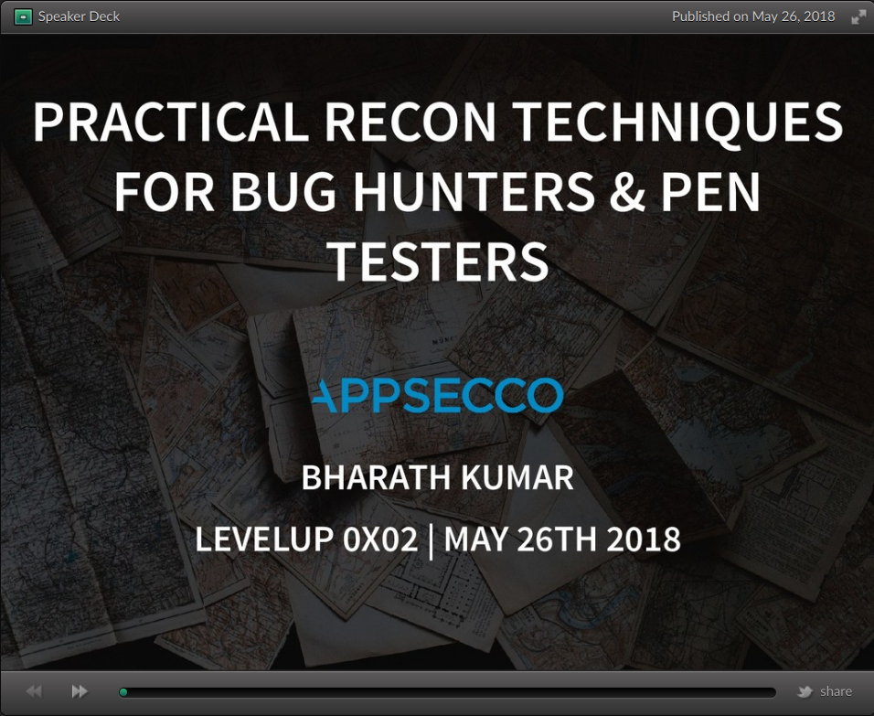
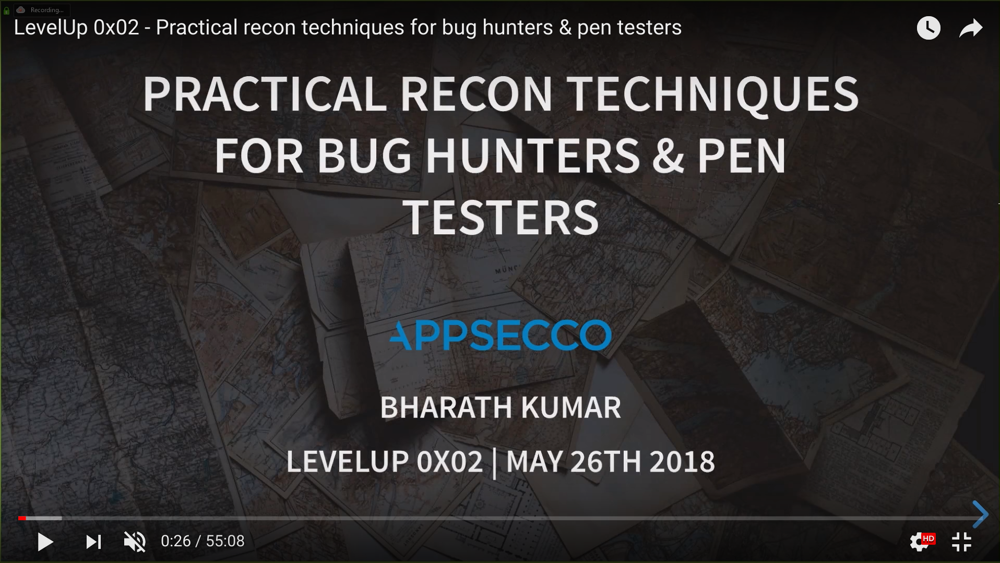

# Practical recon techniques for bug hunters & pentesters

This repository contains all the material from the talk "Practical recon techniques for bug hunters & pentesters" given at Bugcrowd LevelUp 0x02 virtual conference

All the scripts are maintained as part of different repos and are included in this repo as git submodules so ideally if you want to clone along with the submodules, use the following command


```
git clone --recurse-submodules -j8 git@github.com:appsecco/practical-recon-levelup0x02.git
```

## Slide deck

[](https://speakerdeck.com/0xbharath/practical-recon-techniques-for-bug-hunters-and-pentesters)

## Talk video

[](https://www.youtube.com/watch?v=McLdm4c1oLs)

## Rendering the presentation

The presentation is built using [reveal-md](https://github.com/webpro/reveal-md). If you simply want to run the presentation, follow the below steps:

1. Clone the repo `git clone git@github.com:appsecco/practical-recon-levelup0x02.git`
2. Install reveal-md `npm install -g reveal-md`
3. Once reveal-md is installed, browse to the cloned directory and run the following command `reveal-md -t black.css --separator "\n\n\n\n" --vertical-separator "\n\n\n" practical_recon.md`
